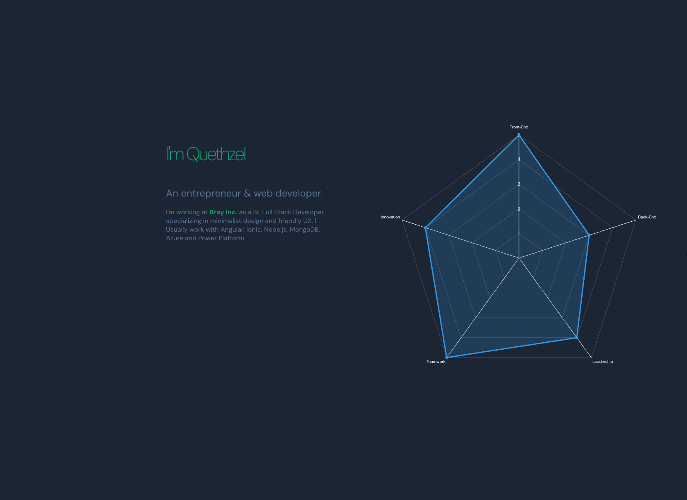
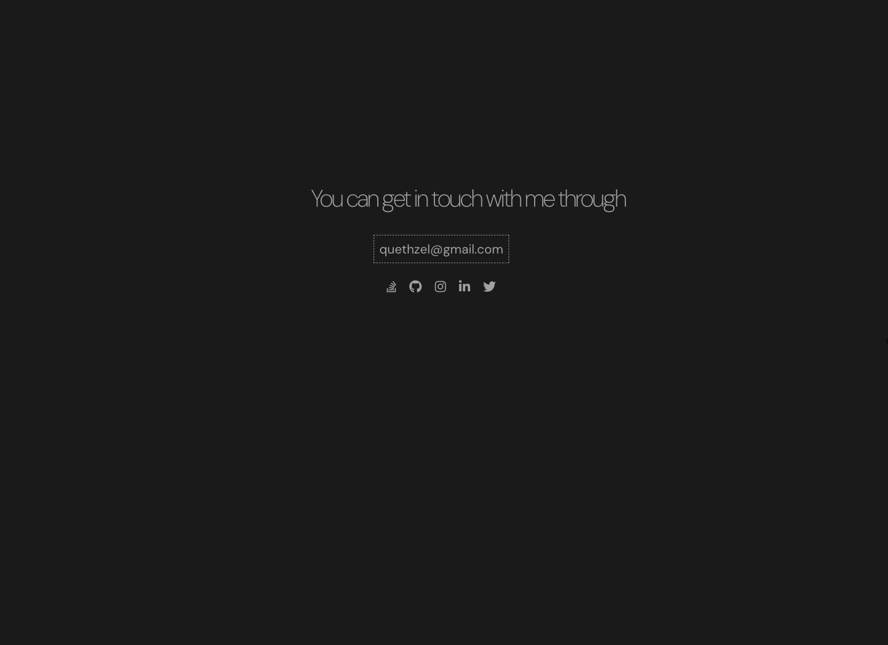

# I am Quethzel 

## About Me Web page template
 
 Minimalist and responsive template as one single page. [Demo here!](https://quethzel.github.io/About-Me-Web-Page/)

 ### Build with
 - HTML
 - CSS
 - Js
 ### Libraries
 - Included
    - Chart.js v2.9.3
    - jQuery v1.9.1
    - jQuery One Page Scroll v1.3.1
 - From CDN
    - Font Awesome v5.13.0 
    - Google Fonts

### How to use it
1. Download or clone the repo.
2. Open `ìndex.html` file in your browser.

### Screenshots

